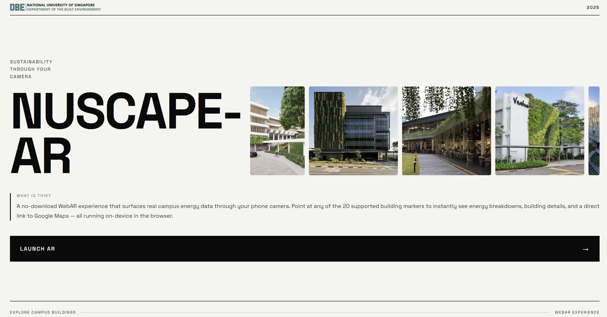

# NUScape-AR

**Augmented Reality for NUS Campus Digital Twin**

A no-download WebAR experience that surfaces real campus energy data through your phone camera. Point at any of the 20 supported building markers to instantly see energy breakdowns, building details, and a direct link to Google Maps — all running on-device in the browser.

🔗 **[Launch the experience →](https://nus-built-environment-web-ar.vercel.app/)**

---



---

## Features

- **Image tracking** — MindAR.js detects printed building markers and anchors A-Frame 3D overlays onto them
- **Energy chart** — Chart.js doughnut panel showing the detected building's annual energy breakdown (Cooling / Equipment / Lighting)
- **Maps panel** — building photo card that taps through to Google Maps
- **Landscape mode** — rotates the entire UI 90° for a better one-hand grip
- **Collapsible panels** — sidebar tabs collapse the chart and map panels to save screen space

No backend, no app install — everything runs on-device in the browser.

---

## Supported Buildings (20)

| Code | Building |
|------|----------|
| CELC | Centre for English Language Communication |
| E1 | Faculty of Engineering |
| E1A | E1A |
| E2 | Engineering block |
| E2A | Zero Energy Building |
| E3 | Engineering block |
| E3A | Engineering block |
| E4 | Engineering block |
| E4A | Engineering block |
| E5 | Engineering block |
| E6 | Engineering block |
| E8 | Engineering block |
| EA | Engineering Auditorium |
| EW1 | Engineering Workshop |
| EW1A | Engineering Workshop Annex |
| SDE1 | School of Design and Environment 1 |
| SDE2 | School of Design and Environment 2 |
| SDE3 | School of Design and Environment 3 |
| SDE4 | School of Design and Environment 4 (net-zero) |
| T-Lab | The Teaching Lab |

---

## Project Structure

```
frontend/
  public/
    ar/
      index.html          # Main AR experience (all 20 buildings)
      targets-all.mind    # Compiled MindAR image targets (20 buildings)
      imgs/               # Building map-view photos for the maps panel
      map_pin.glb         # Animated map pin 3D model
    models/               # Individual building GLB models
    bg*.png               # Landing page background photos
    logo.png              # NUS Built Environment logo
  src/
    pages/
      Home.jsx            # Landing page
      Home.css
docs/                     # README screenshots
scripts/
  compile-mind.js         # Compile/merge .mind target files
  crop-markers.js         # Crop individual marker PNGs from a sheet (JS)
  crop_markers.py         # Crop individual marker PNGs from a sheet (Python)
  color-buildings.mjs     # Recolour building GLB models
  split-buildings.mjs     # Split scene GLB into individual building files
```

---

## Running Locally

```bash
cd frontend
npm install
npm run dev
```

The AR page (`public/ar/index.html`) is a static HTML file served directly by Vite — no build step needed for the AR itself.

---

## Dependencies

| Library | Version | Purpose |
|---------|---------|---------|
| [MindAR](https://hiukim.github.io/mind-ar-js-doc/) | 1.2.2 | Image target tracking |
| [A-Frame](https://aframe.io) | 1.4.2 | 3D scene and AR overlay rendering |
| [Chart.js](https://www.chartjs.org) | 4.4.0 | Energy use doughnut chart |
| React + Vite | — | Landing page |

---

## AR Markers

Building markers were generated with **[ARMaker](https://shawnlehner.github.io/ARMaker/)** by Shawn Lehner. Each marker encodes a unique visual pattern that MindAR tracks in the live camera feed.

The compiled `targets-all.mind` file was produced by merging individual per-building `.mind` files — decoding each with `@msgpack/msgpack`, concatenating their `dataList` arrays, and re-encoding into a single file. `compile-mind.js` handles this process.

---

*Built for NUS Department of the Built Environment · 2025*
