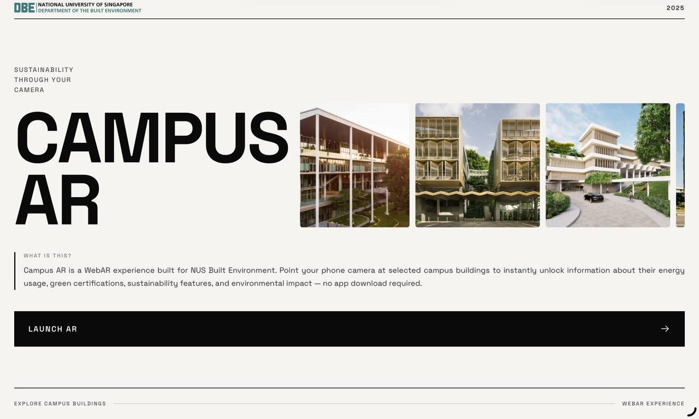
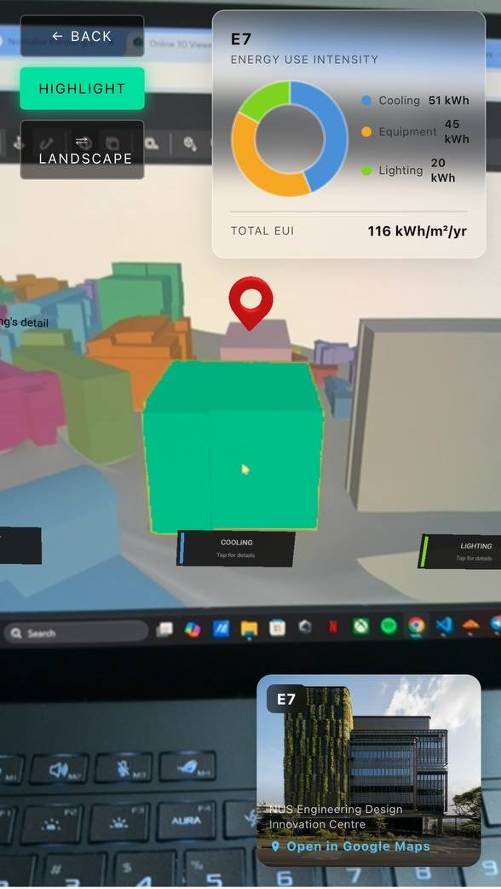

# NUS Built Environment — Campus AR

**A no-download WebAR experience that brings campus sustainability data to life through your phone camera.**

Point your camera at SDE4 or E7 to instantly surface energy use breakdowns, green certifications, and building details — all running on-device in the browser.

🔗 **[Launch the experience →](https://nus-built-environment-web-ar.vercel.app/)**

---




---

## Buildings

| Building | Targets | Total EUI |
|----------|---------|-----------|
| **SDE4** — School of Design and Environment 4 | 6 image targets | 86 kWh/m²/yr |
| **E7** — Engineering Design Innovation Centre | 4 image targets | 116 kWh/m²/yr |

---

## Features

- **Image tracking** — MindAR.js detects facade photos in the live camera feed and anchors A-Frame 3D overlays onto the building
- **Energy chart** — Chart.js doughnut panel showing the detected building's energy breakdown (Cooling / Equipment / Lighting)
- **Highlight** — per-pixel colour segmentation on the camera feed highlights the building's facade (see below)
- **Audio narration** — Web Speech API reads a building description aloud with a typewriter caption overlay
- **Maps panel** — taps through to Google Maps Street View of the building

No backend, no app install — everything runs on-device in the browser.

---

## Highlight

Pressing the **HIGHLIGHT** button overlays a colour mask on the detected building's facade.



It works by running per-pixel HSV colour segmentation on the raw camera feed:

- **SDE4** — teal (`#1abdbd`, hue ≈ 180°), tolerance ±24°
- **E7** — chartreuse (`#ADD129`, hue ≈ 73°), tolerance ±14°

E7's facade colour in the campus 3D model was recoloured from its original tan to chartreuse to create a unique hue gap (60–99°) with no neighbouring buildings, reducing false positives. Matching pixels are recoloured with a `#00e0a0`-based colourmap and composited over the live camera feed via a canvas element.

---

## Project structure

```
frontend/
  public/
    ar/
      index.html          # Combined SDE4 + E7 AR experience
      targets-all.mind    # Combined MindAR targets (10 total: SDE4 0–5, E7 6–9)
      image-targets/      # Source images used to train the .mind file
      map_pin.glb         # Animated map pin model
      volume.glb          # Speaker icon model
    models/               # Individual building GLB models
    bg*.png               # Building reference photos
    logo.png              # NUS Built Environment logo
  src/
    pages/
      Home.jsx            # Landing page with building marquee and AR launch button
      Home.css
docs/                     # README screenshots
```

---

## Running locally

```bash
cd frontend
npm install
npm run dev
```

The AR page (`public/ar/index.html`) is a static HTML file served directly by Vite — no build step needed for the AR itself.

---

## Dependencies

| Library | Version | Purpose |
|---------|---------|---------|
| [MindAR](https://hiukim.github.io/mind-ar-js-doc/) | 1.2.2 | Image target tracking |
| [A-Frame](https://aframe.io) | 1.4.2 | 3D scene and AR overlay rendering |
| [Chart.js](https://www.chartjs.org) | 4.4.0 | Energy use doughnut chart |
| React + Vite | — | Landing page |

---

## Mind file

`targets-all.mind` was compiled by combining two separate mind files using `@msgpack/msgpack` — decoding both, concatenating their `dataList` arrays, and re-encoding. SDE4 targets occupy indices 0–5; E7 targets occupy indices 6–9. E7 targets were trained on photos with rich surrounding campus context to maximise keypoint density.

---

*Built for NUS Department of the Built Environment · 2025*
